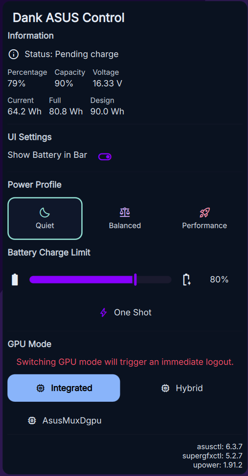

# Dank ASUS Control Center for DankMaterialShell
Continuation of [ASUS Control Center](https://github.com/pseudofractal/AsusControl)

Power & GPU Management for ASUS Laptops.  
A plugin for [DankMaterialShell](https://github.com/AvengeMedia/DankMaterialShell)

<div align="center">
  
</div>

**Dank Asus Control Center** is a plugin for DankMaterialShell that integrates `asusctl` and `supergfxctl` directly into your desktop interface. It provides a seamless way to interact with `asusctl` & `supergfxctl` without opening your terminal.

## Features

- **Power Profiles**: Switch between *Quiet*, *Balanced*, and *Performance* modes on the fly.
- **GPU Switching**: Toggle *Integrated*, *Hybrid*, and *Dedicated* graphics modes.
- **Auto-Logout**: Automatically detects your session (Hyprland, Niri, Sway, KDE, Gnome, etc.) and performs the required logout when switching GPU modes.
- **Battery Charge Tray Icon**: Shows current battery charge percentage as a tray icon
- **Battery Charge Limit/One Shot**: Allows you to change the charge limit for your battery, while One Shot will temporarily remove this limit in order to charge your battery to 100%

## Requirements

This plugin requires the following to be installed on your system:

1.  **[DankMaterialShell](https://github.com/AvengeMedia/DankMaterialShell)**: The shell environment.
2.  **[asusctl](https://gitlab.com/asus-linux/asusctl)**: For power profile management.
3.  **[supergfxctl](https://gitlab.com/asus-linux/supergfxctl)**: For GPU switching.
4.  **[upower](https://upower.freedesktop.org/)**: For Battery stats.

> **Note**: Ensure the `supergfxd` service is active and your user has permissions to control it (usually by being part of the `asus-users` group).

## Installation

### Manual Installation

Clone this repository into your DankMaterialShell plugins directory (typically located at `~/.config/DankMaterialShell/plugins` depending on your setup).

```bash
cd ~/.config/DankMaterialShell/plugins
git clone https://github.com/shazzaam7/DankAsusControl.git
```

Once installed, restart DankMaterialShell using `hype restart`.

## Usage

1.  **Add to Layout**: Add the `asusControlCenter` widget to configuration in DMS.
2.  **Interact**:
    *   Click the icon to open the popout menu.
    *   Select a **Power Profile** to apply it immediately.
    *   Select a **GPU Mode** to switch graphics cards.
        *   ⚠️ **Warning**: Switching GPU modes requires a session restart. The plugin will notify you and log you out automatically after 5 seconds.

## Configuration

The widget attempts to auto-detect your desktop environment to handle logouts. If you use a custom setup, you can modify the `desktopSpecificCommands` map in `AsusControlCenter.qml`:

```qml
readonly property var desktopSpecificCommands: {
  "hyprland": ["hyprctl", "dispatch", "exit"],
  "niri":     ["niri", "msg", "action", "quit"],
  // ... add your custom logout command here
}
```
